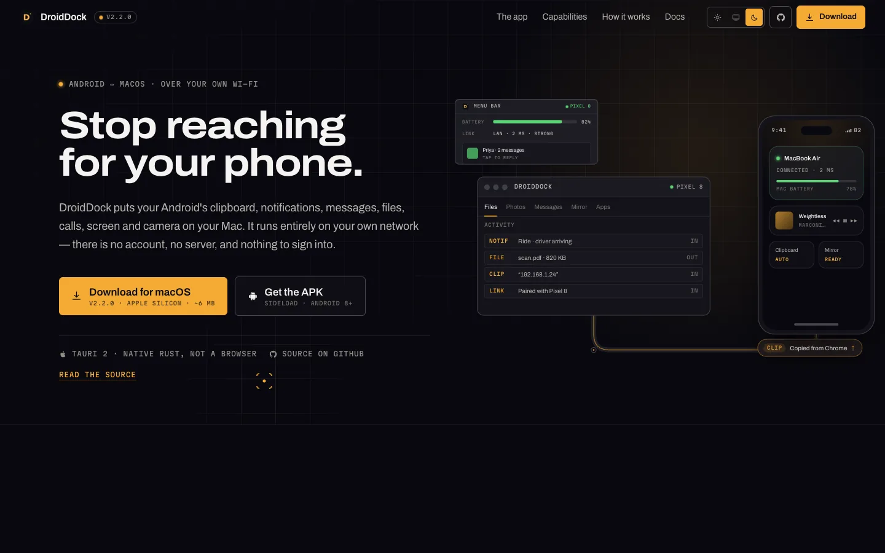
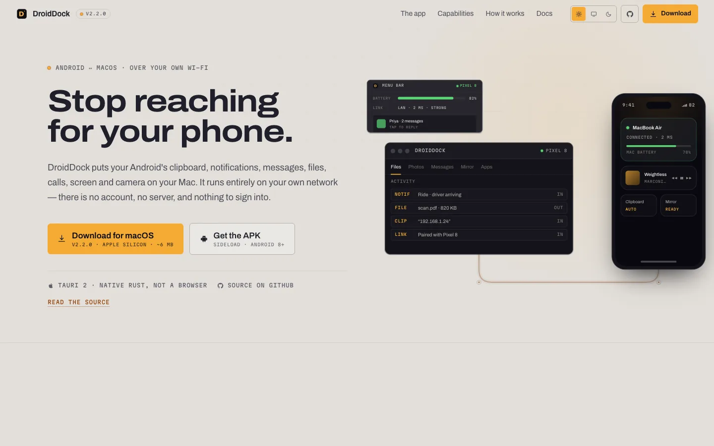
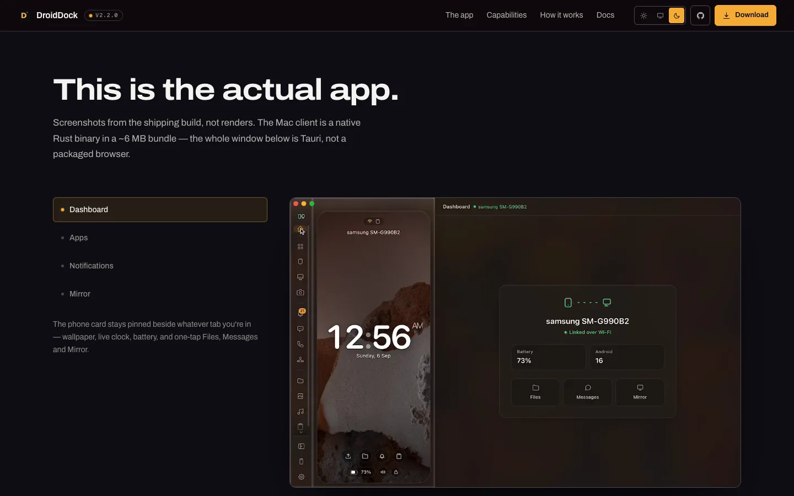
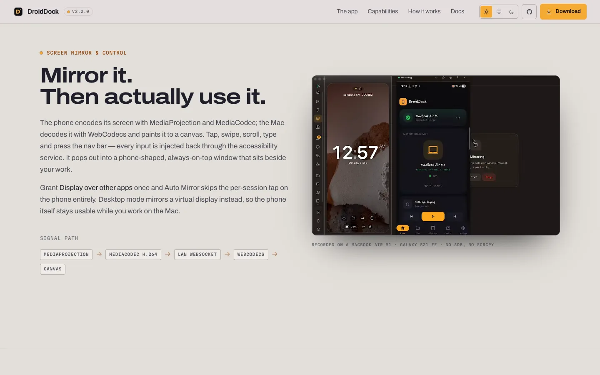
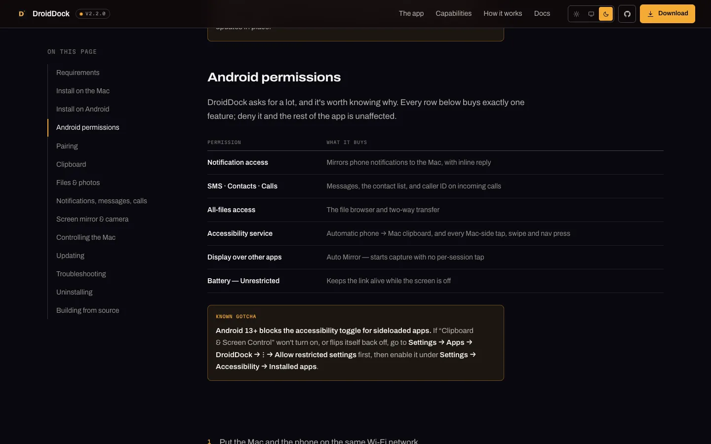
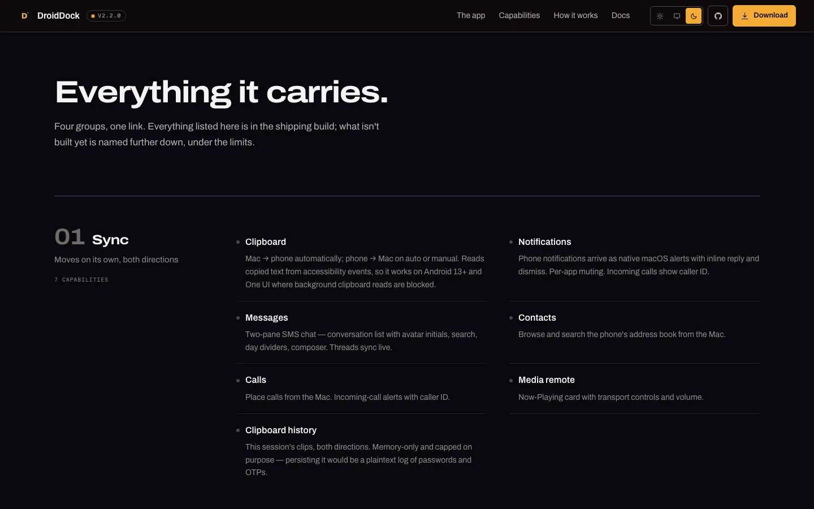
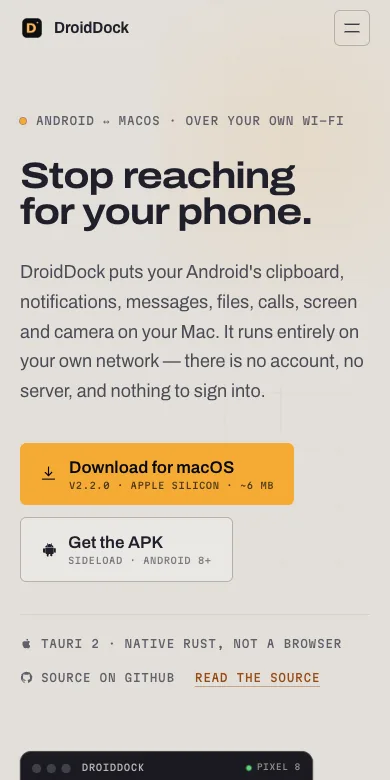

<div align="center">

<a href="https://himanshudev28.github.io/DroidDockWebsite/">
  
</a>

# DroidDock — Website

### The marketing site and documentation for [DroidDock](https://github.com/himanshudev28/MacDroid), the Android ↔ Mac bridge.

### [**himanshudev28.github.io/DroidDockWebsite**](https://himanshudev28.github.io/DroidDockWebsite/)

[](https://himanshudev28.github.io/DroidDockWebsite/)

<br />


[](https://github.com/himanshudev28/DroidDockWebsite/actions/workflows/deploy-pages.yml)

<br />

<a href="https://himanshudev28.github.io/DroidDockWebsite/">
  
</a>

</div>

---

## What this is

A five-page static site: an overview, full documentation, privacy, terms and a
404. No client-side router, no backend, no analytics, no cookies. It builds to
**~1.7 MB** including every screenshot, the product video and self-hosted fonts.

The design register is an **instrument panel** rather than a SaaS landing page —
graphite and amber taken straight from the app's own palette, industrial signage
type, and a signal bus that carries labelled packets between the two devices.
Every capability claim on the page is transcribed from the app's README; if it
isn't true of the shipping build, it isn't here.

<table>
<tr>
<td width="50%"></td>
<td width="50%"></td>
</tr>
<tr>
<td align="center"><b>Light mode</b> — anodised aluminium, not paper</td>
<td align="center"><b>Real screenshots</b> — no mockups, no renders</td>
</tr>
<tr>
<td width="50%"></td>
<td width="50%"></td>
</tr>
<tr>
<td align="center"><b>Product video</b> — the real mirror flow</td>
<td align="center"><b>Docs</b> — sticky TOC, permissions, troubleshooting</td>
</tr>
<tr>
<td width="50%"></td>
<td width="50%" align="center"></td>
</tr>
<tr>
<td align="center"><b>Capabilities</b> — a spec sheet, not card soup</td>
<td align="center"><b>390px</b> — the hero stage relayouts, it doesn't shrink</td>
</tr>
</table>

---

## Quick start

```bash
npm install
npm run dev        # http://localhost:5173
npm run build      # regenerates HTML shells, typechecks, builds to dist/
npm run preview
npm run typecheck
```

## Pages

A plain Vite **multi-page** build — real URLs, no router, works on any static
host without a rewrite rule.

| URL | Source | What's on it |
|---|---|---|
| `/` | [`HomePage.tsx`](src/pages/HomePage.tsx) | Hero, capabilities, protocol, install, limits |
| `/docs/` | [`DocsPage.tsx`](src/pages/DocsPage.tsx) | 14 sections, permissions table, 9 troubleshooting entries |
| `/privacy/` | [`PrivacyPage.tsx`](src/pages/PrivacyPage.tsx) | What's collected (nothing) and the honest encryption scope |
| `/terms/` | [`TermsPage.tsx`](src/pages/TermsPage.tsx) | As-is, no warranty, licence status, no affiliation |
| `404.html` | [`NotFoundPage.tsx`](src/pages/NotFoundPage.tsx) | Needed for GitHub Pages anyway |

> [!IMPORTANT]
> **The `.html` files are generated — don't hand-edit them.**
> [`scripts/gen-html.mjs`](scripts/gen-html.mjs) writes all five from one
> template so the meta tags, font preloads and the no-flash theme script can't
> drift apart. Adding a page means editing that script *and*
> `rollupOptions.input` in [`vite.config.ts`](vite.config.ts).

## Deploying

Every push to `main` builds and publishes to GitHub Pages via
[`.github/workflows/deploy-pages.yml`](.github/workflows/deploy-pages.yml).
Nothing to run by hand.

**Live:** https://himanshudev28.github.io/DroidDockWebsite/

Because that's a *project* site, everything is served from a sub-path, so
`base` in [`vite.config.ts`](vite.config.ts) defaults to
`/DroidDockWebsite/`. Moving to a custom domain or a root-hosted deploy means
overriding it:

```bash
BASE_PATH=/ npm run build
```

Internal links and `/public` assets referenced from JSX all go through
[`src/lib/paths.ts`](src/lib/paths.ts) — Vite rewrites URLs it can see at build
time, but not strings built at runtime, so a sub-path deploy would otherwise
ship broken image and video `src`s.

> [!NOTE]
> The workflow passes `BASE_PATH` from the repository name, so renaming the
> repo moves the deploy without a code change.

## Theming

Dark is the design default; the site follows the OS unless the visitor picks a
theme from the rocker in the nav, which persists to `localStorage`.

> [!WARNING]
> Three things are easy to get wrong here.
>
> - **A custom property is substituted where it's *declared*.** Anything
>   declared only on `:root` inherits already-resolved, so `.on-dark` has to
>   re-declare the `--color-*` names themselves. `light-dark()` fails for the
>   same reason and is deliberately not used for the ramps.
> - **`.on-dark` pins a subtree to the dark ramp.** The device mockups, the
>   video and the screenshot frames are pictures of a dark app and shouldn't
>   invert with the page. The hero's bus and packets sit *outside* it, because
>   they're page furniture drawn on the page ground.
> - **`text-ink` on an amber fill is a bug.** `ink` is the page, so on a light
>   page that's near-white on amber (1.6:1). Use `text-on-amber`. Accent *text*
>   uses `text-amber-ink` for the same reason — flat brand amber is only 1.65:1
>   on the light ground, though it's fine as a fill.

Both ramps were contrast-checked before being written down; ratios are noted
inline in [`src/index.css`](src/index.css).

## Pointer

Two effects, both fine-pointer-only and both **fully absent under
`prefers-reduced-motion`**. The native cursor is only hidden once the reticle is
confirmed live, so a failure can't leave anyone without a pointer.

- [`Pointer.tsx`](src/ui/Pointer.tsx) — a reticle whose corner brackets snap
  around whatever is under it, echoing the app's QR scan screen. Text fields
  keep their I-beam.
- [`SpotlightGrid.tsx`](src/ui/SpotlightGrid.tsx) — the instrument grid lit
  under the cursor, via a moving mask so it stays compositor-only.

## Media

Screenshots and the mirror clip are derived from two screen recordings kept in
`media-src/` (gitignored — ~37 MB, and they never ship). What the site serves
lives in `public/shots` (WebP, 1x + 2x) and `public/clips` (mp4 + webm) and
comes to well under 1 MB.

<details>
<summary><b>Regenerating them</b> (needs <code>ffmpeg</code> and <code>cwebp</code>)</summary>

```bash
# a still, at 1x and 2x
ffmpeg -y -ss 3 -i media-src/DroidDock_Mac.mp4 -frames:v 1 \
  -vf "scale=1120:-2:flags=lanczos" /tmp/_2x.png
ffmpeg -y -i /tmp/_2x.png -vf "scale=iw/2:-2:flags=lanczos" /tmp/_1x.png
cwebp -q 80 -m 6 -sharp_yuv /tmp/_2x.png -o public/shots/mac-dashboard@2x.webp
cwebp -q 82 -m 6 -sharp_yuv /tmp/_1x.png -o public/shots/mac-dashboard.webp

# the looping clip (silent, 30fps, both codecs)
ffmpeg -y -ss 65 -t 8.2 -i media-src/DroidDock_Mac.mp4 -an \
  -vf "fps=30,scale=1120:-2:flags=lanczos" \
  -c:v libx264 -pix_fmt yuv420p -crf 27 -preset slow -movflags +faststart \
  public/clips/mirror.mp4
ffmpeg -y -ss 65 -t 8.2 -i media-src/DroidDock_Mac.mp4 -an \
  -vf "fps=30,scale=1120:-2:flags=lanczos" \
  -c:v libvpx-vp9 -crf 38 -b:v 0 -row-mt 1 public/clips/mirror.webm
```

Filenames, alt text and captions live in
[`Showcase.tsx`](src/components/Showcase.tsx). The sources are 1120×720 (Mac)
and 720×1560 (phone), so **don't display them wider than that** — there's no
more detail to get, and stretching them past native is what made the first pass
look soft.

</details>

## Fonts

Archivo and Martian Mono are **self-hosted** from `public/fonts` (latin subsets,
~212 KB). That's deliberate: the site makes no third-party request, which is
what lets the privacy policy say so plainly. Regenerate by fetching the Google
Fonts CSS with a modern browser UA, pulling the `latin` and `latin-ext` `.woff2`
URLs, and updating [`src/fonts.css`](src/fonts.css).

## Updating for a new DroidDock release

Every release fact lives in one file:
[`src/lib/content.ts`](src/lib/content.ts). Bump `RELEASE.version` and the
`dmg` / `apk` URLs after tagging, and the nav badge, both hero buttons, the
install steps, the docs and the footer all follow.

## Structure

| Path | What |
|---|---|
| [`src/index.css`](src/index.css) | Design tokens — both ramps, type, easing, z-scale, prose |
| [`src/lib/content.ts`](src/lib/content.ts) | Every release fact and marketing string |
| [`src/lib/theme.ts`](src/lib/theme.ts) | Theme state; must stay in step with the `<head>` script |
| [`src/lib/paths.ts`](src/lib/paths.ts) | Base-aware URLs for links and public assets |
| [`src/lib/motion.ts`](src/lib/motion.ts) | Shared variants, easings, reduced-motion + on-screen loop hooks |
| [`src/Shell.tsx`](src/Shell.tsx) | Nav + Pointer + Footer + MotionConfig, shared by every page |
| [`src/ui/`](src/ui) | Primitives, icons, theme rocker, clip player, pointer effects |
| [`src/components/LinkStage.tsx`](src/components/LinkStage.tsx) | The hero: animated Mac ↔ phone bus, two real layouts |
| [`src/components/Showcase.tsx`](src/components/Showcase.tsx) | Real app screenshots (tabbed) + the phone shots |

<details>
<summary><b>Traps worth remembering</b></summary>

- **`min-width: auto` on grid/flex items.** A grid item won't shrink below its
  min-content, so one unbreakable `xattr` line once forced the whole page 251px
  wider than the viewport on mobile — and the docs code block did it again
  later. Grid/flex ancestors of wide content need `min-w-0`.
- **The hero stage has two layouts, not one that shrinks.** `WIDE` and
  `COMPACT` in `LinkStage.tsx` are separate design grids; the compact one is
  used below 640px so device UI stays near 1:1 instead of scaling to ~44%.
- **The stage scale is measured, not CSS.** `scale()` takes a number, so
  `calc(100cqw / 780)` resolves to a *length*, the declaration is dropped, and
  the stage silently overflows.
- **Reveal thresholds.** `inView` uses `amount: 'some'`; a fractional threshold
  on a wrapper taller than the viewport can be skipped by a fast flick-scroll,
  and `once: true` would leave it stuck hidden.
- Ambient loops (packets, notification stack, the mirror clip) run only while
  on screen and the tab is visible.

</details>

## Accessibility & QA

Verified across **30 page × viewport × theme combinations** (5 pages × 390 /
820 / 1512 px × light / dark): no console errors, no failed requests, no
horizontal overflow, exactly one `<h1>` per page, no broken images, no dead
links. Contrast for both ramps was computed in OKLCH and checked against WCAG
before the tokens were written. Reduced motion is honoured twice — the CSS
media query for transitions, and `<MotionConfig reducedMotion="user">` for
JS-driven animation, which the media query cannot reach.

## Licence

No `LICENSE` file has been added yet, so by default all rights are reserved.
Add one if you want the source to be reusable — the terms page reads the same
way and should be updated alongside it.

<div align="center">
<br />
<sub>Built for a friction-free desk.</sub>
</div>
